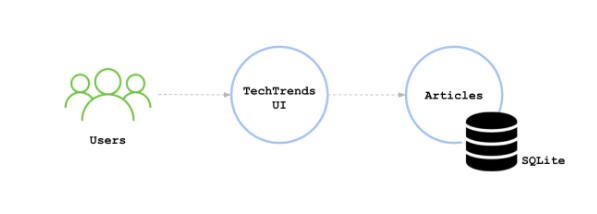
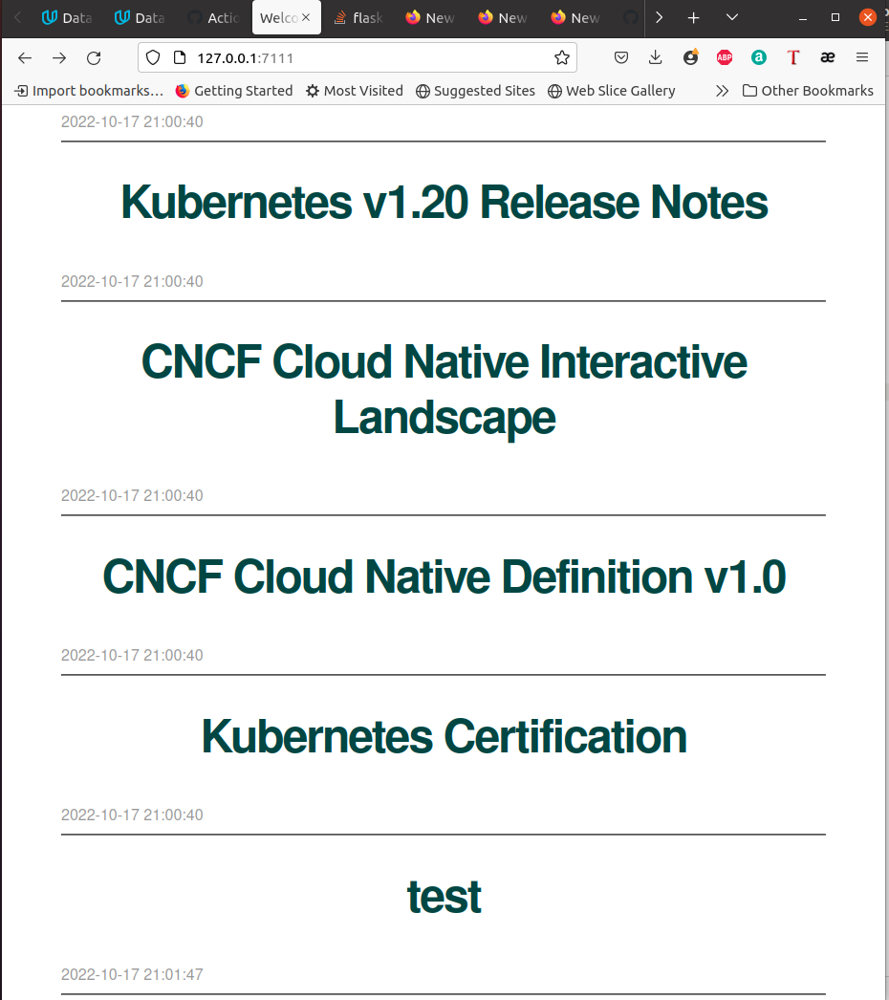
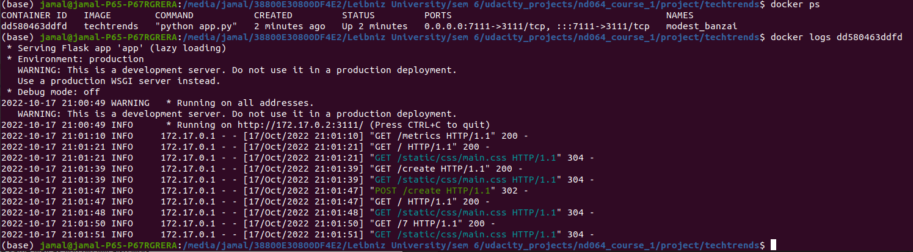
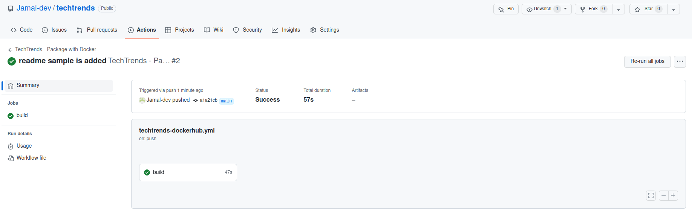
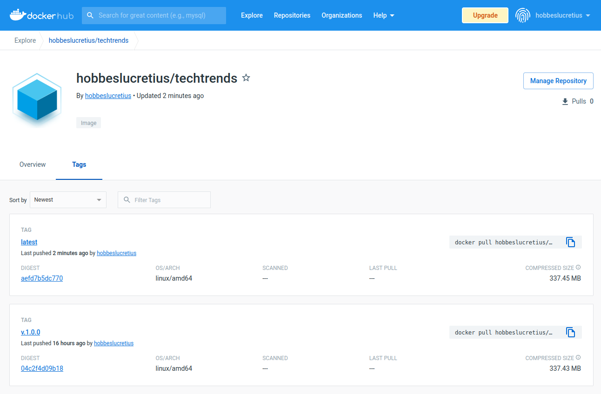
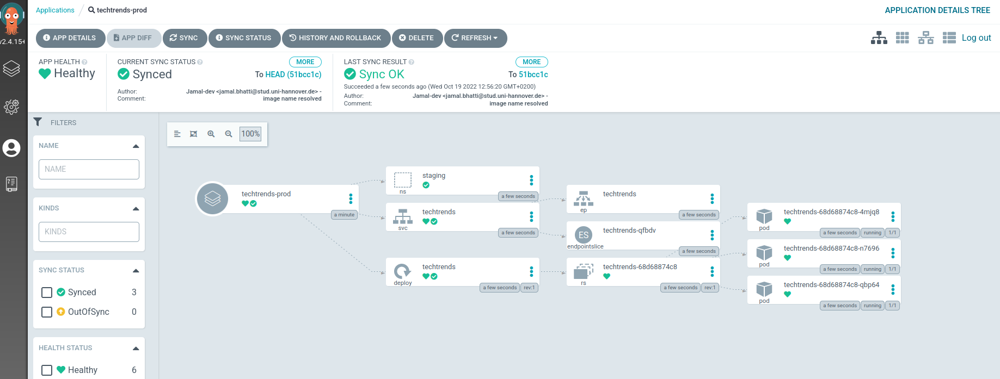

# TechTreds Web Application

This is a cloud native application in which people can share news using this platform with in the clould native ecosystem.

This project using docker for the image creation, and Kubernetes for the container orchestration.

It also uses Github action for the continuous integration

For the continuous development Hlem+ ArgoCD was utilized

